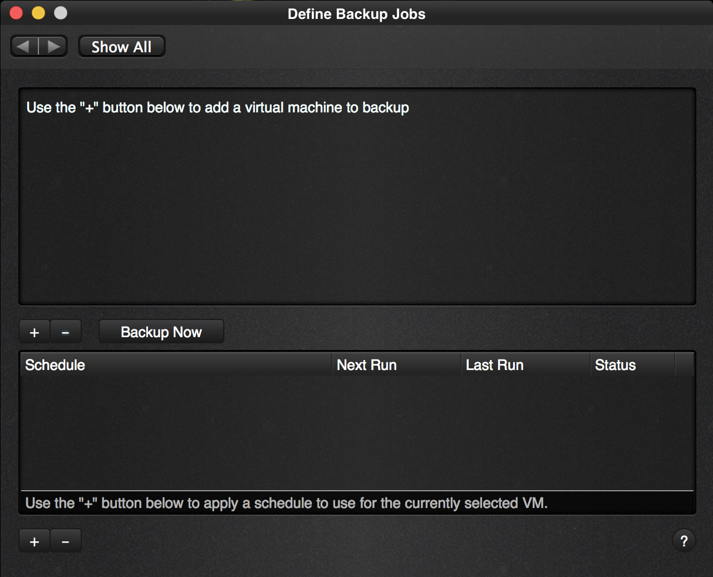
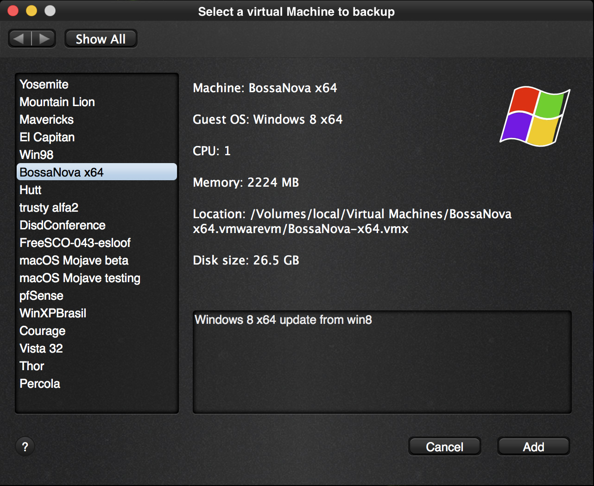
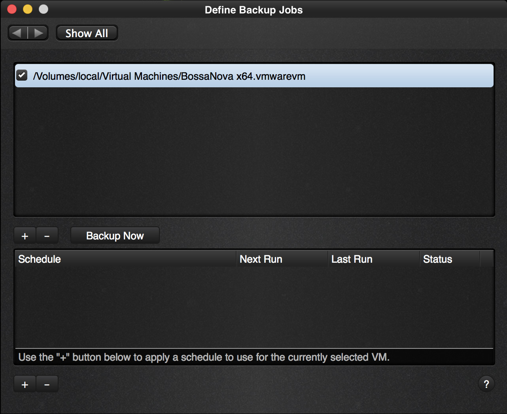

To backup a virtual machine, we are first going to select the Virtual Machine we are about to backup.

We’re back at the options screen

Let’s make our first backup. Adding a virtual machine to Vimalin is done so that you can select it later to backup.

| 
|:--:|
| *Options screen* |

### Define a backup job
Click on “Backup jobs” and the following screen appears:

| 
|:--:|
| *A completely empty “define backup job” screen* |

The screen is pretty empty, because no virtual machines or jobs have been defined so far.

Click on the “+” button right above the schedule header. With this button you can select a virtual machine.

| 
|:--:|
| *Select a virtual machine to backup dialog* |

Vimalin will show a list of all the virtual machines (VM’s) that have been added to the library of VMware Fusion. In our example we are selecting a VM that has Windows 8 installed. It is called “BossaNova x64”, so we select that and then we click on the Add button.

| 

After this we are back in the “Define Backup Jobs” screen. We have a virtual machine in our list, so that we can run backups. As you can see, the “Backup Now” button has become available, because we have selected a virtual machine.

Let’s click that “Backup Now” button to run a backup on demand.