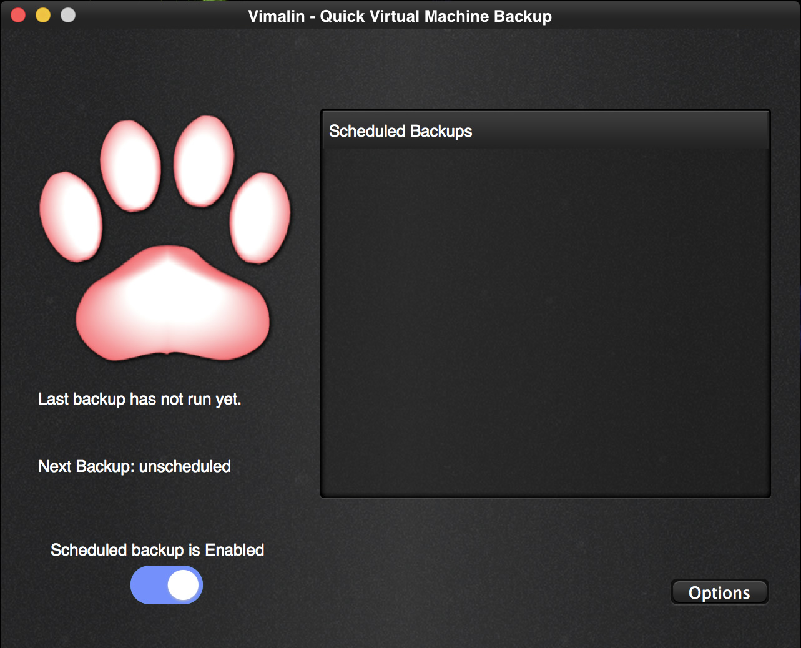
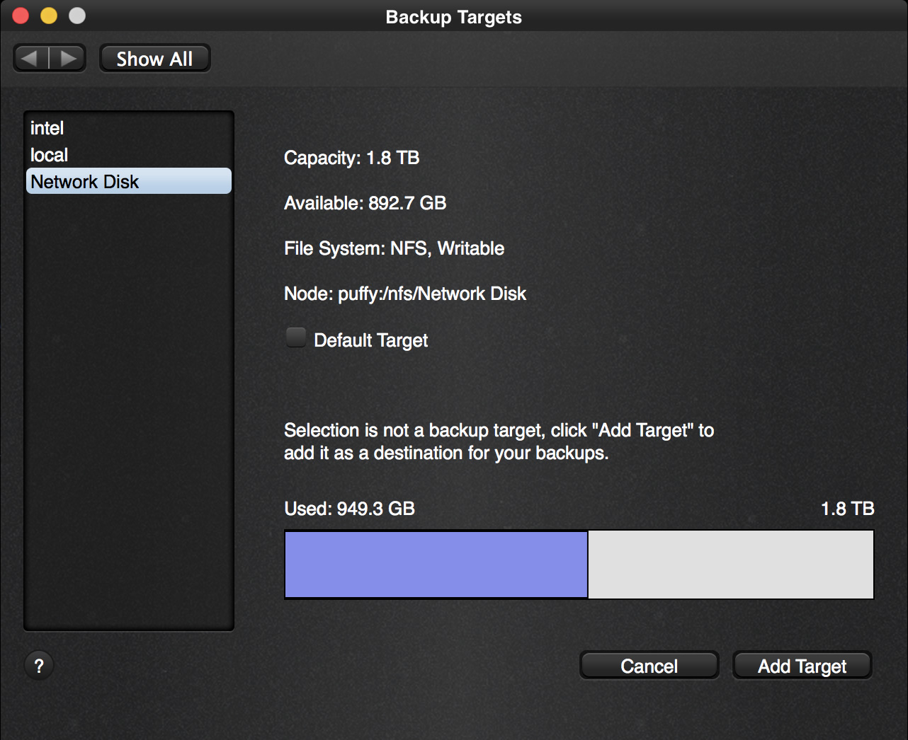
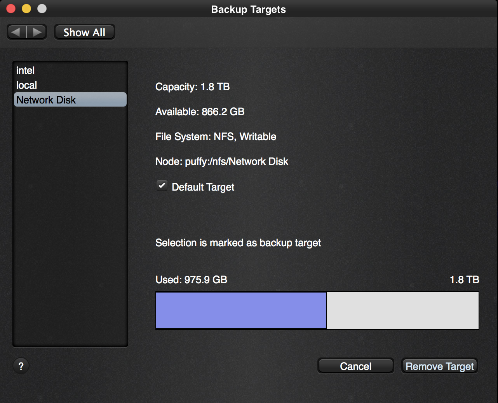

Now that you have installed Vimalin, the first thing to do is to configure it.

| 
|:--:|
| *Vimalin – opening screen after installation* |

So click on the options button to go to the screen where you can customize your settings.

| 
|:--:|
| *Vimalin – Options Screen* |

Your backups have to be written somewhere so you have to tell where you want them to be stored. This has to be an external disk or a local network location, you cannot backup to your own machine. This is because a backup that not exists anymore when your machine dies is not a very helpful backup.

Select the Backup Targets icon to configure it.

| 
|:--:|
| *Vimalin – Add Backup Targets* |

This screen displays all your connected disks and network locations. You can set multiple backup targets if you want, but for now, we add the first disk to store your backups. The first one is also marked as your default location (which you can change later on if wanted)

Now click on the button “Add Target” after selecting the backup device in the list on the left.

| 
|:--:|
| *Vimalin – backup target selected* |

This created a new folder on your device called “Vimalin”, it will put all your backups in that folder by default.

Now we go back to the config – click “Show All” or “Back” to return to the options screen and continue to Add a virtual machine to backup