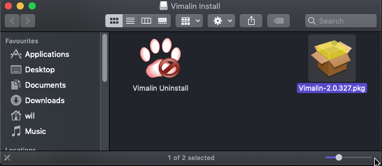
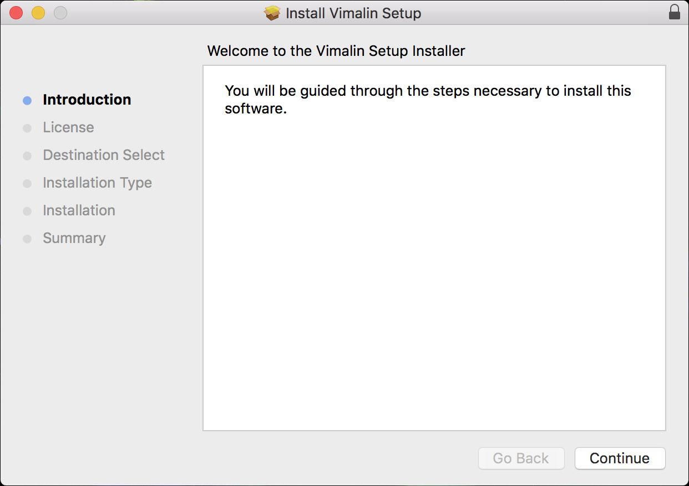

### Steps to install Vimalin
First download the install media from our website. Double click on the .dmg image and the following screen will open in Finder.

| 
|:--:|
| *Displays the contents of the .dmg package* |

In order to install you have to run the installer. You do this by double clicking the Vimalin-2.5.425.pkg file. After that you will get the following screen.

| 
|:--:|
| *Welcome page of the Vimalin Installer program* |

Select Continue to start the installation.

| 
|:--:|
| *License agreement for Vimalin software* |

The screen presents the license agreement to you. In order to continue to the next steps, you will have to agree with the license. The screen “Destination Select” will only show up in certain conditions. It doesn’t matter much, just continue. Do not change the default location.

| 
|:--:|
| *Select destination for software install* |

The “installation type” screen shows you what is going to be installed. Click “Install” to continue and start with the actual installtion

| 
|:--:|
| *Start installation of Vimalin files on disk* |

The installer then asks for your password. It needs your password, so that it can install the worker process which runs in the background.

The worker process eventually is what schedules your backups and takes care of the actual backup even when you do not have the Vimalin application running.

| 

You get this screen when the installation was a success:

| 
|:--:|
| *Installation of Vimalin succeeded* |

After that you will find the Vimalin app under Applications. When you start it you should get the following welcome screen.

| 

As you can see the backup functionality is enabled and no backups have yet been scheduled.