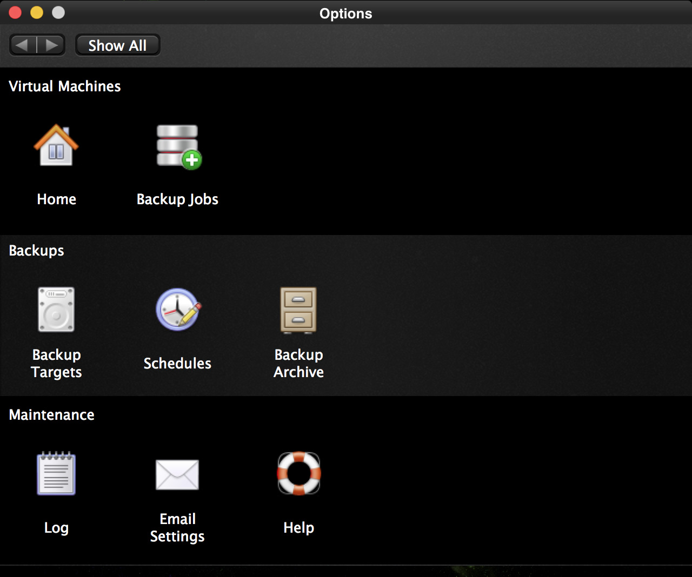

With Vimalin you can create a schedule to determine on when a backup runs automatically.

| 
|:--:|
| *Vimalin – Options screen* |

From our options page we click on the Schedules icon and get the following screen.

| 
|:--:|
| *Vimalin Predefined Backup Schedules* |

When you install Vimalin it is already configured with 3 default schedules that you can adjust to your liking.

In our case we are going to create a new schedule, that runs while we are having a meeting at 19:00pm and want Vimalin to run a backup while we are there.

Click on the little “+” button under the list that has the 3 pre-made schedules.

| 
|:--:|
| *Creating a new virtual machine backup schedule* |

You can give the schedule any name you like, we call it “While Away”.

We have scheduled it to make 4 copies, 1 every day (1 backup, repeated each time after 1 day, repeat 3 times). We also want to limit the amount of copies to keep. The schedule is set it to keep 3 backups, so the last backup will overwrite the first copy once it runs.

We do not select a different backup target as we are fine with the default backup target. You can click the “Show all” button or change rows to save this new schedule.

In our case we go back to the options screen via the “Show All” button so that we can schedule a job.