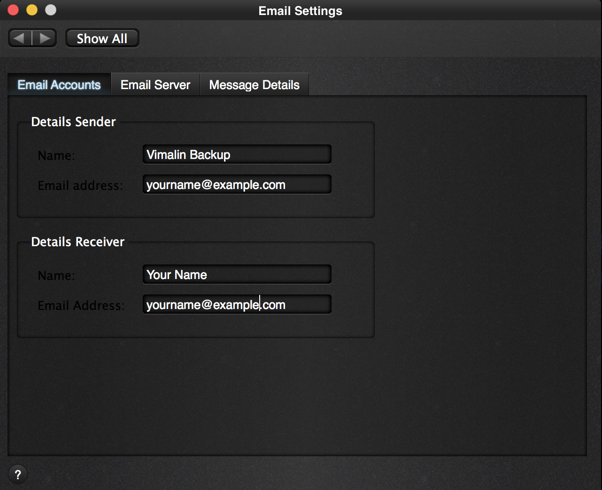
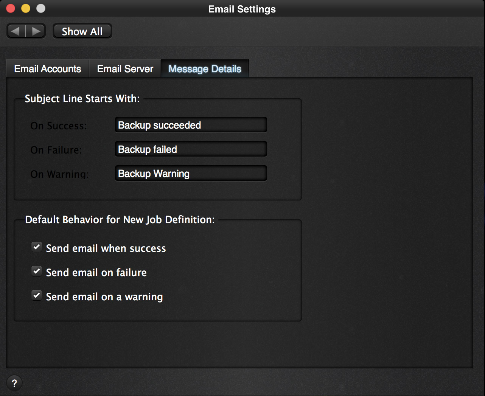

In the options page you will also find the icon for setting up email confirmations.

| 
|:--:|
| *Vimalin Options Screen* |

### Configure email accounts

The following screen appears after clicking the icon for Email Settings.

| 
|:--:|
| *Vimalin Email Settings – Email Accounts tab page* |

On this tab page you can fill in the email addresses and names to use. Vimalin then uses this for the sender of the email (example above: Vimalin Backup) and the email box where you want to receive your notifications.

### Configure email server

Once done go to the following tab page to enter the email server details.

| 
|:--:|
| *Email Settings – Email Server configuration tab page* |

Enter the address of the email server (smtp server) that you want to use for sending the emails. It will be different from the example that is displayed here. Also provide the login name and password that might be required for sending the emails.

Finally select the smtp server port. Note that nowadays port 25 is commonly blocked by providers. So unless you are using the email server of your internet provider, you will likely have to use either port 465 or port 587.

Select the appropriate encryption if the connection to your email server is encrypted.

After you entered the email details, you can test your settings by pressing the “Test Settings” button. Vimalin will then try to send a test email via your email server to check if things are setup correctly.

Please first check your spam folder if Vimalin says “message send” and you haven’t received anything.

Configure email notifications
Finally once all that works, you can tweak your email notification settings at the last tab page.

| 
|:--:|
| *Email Settings – Message Details tab page* |

Here you can configure when Vimalin should send you an email. The subject line can be customized with a subject prefix that you want the subject of your email to start with.

This feature allows you to setup email filters in your email program. With email filters you can manage how-to handle the backup confirmation success, fail or warning messages.

### Google email setup

Google has been tying up their email server access and nowadays requires you to use something they call “Sign in with Google”. Google requires apps using that option to be certified, which sadly is extremely expensive.
However there is an alternative option and it is called App passwords.

You can read more about it here: [Google Sign in with App passwords](https://support.google.com/accounts/answer/185833)

