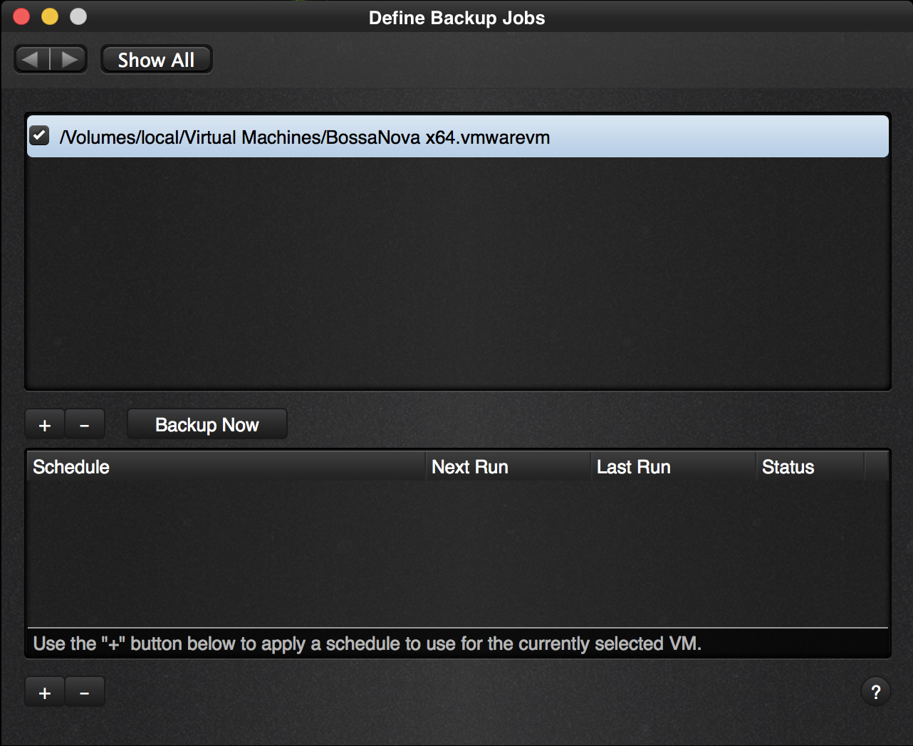
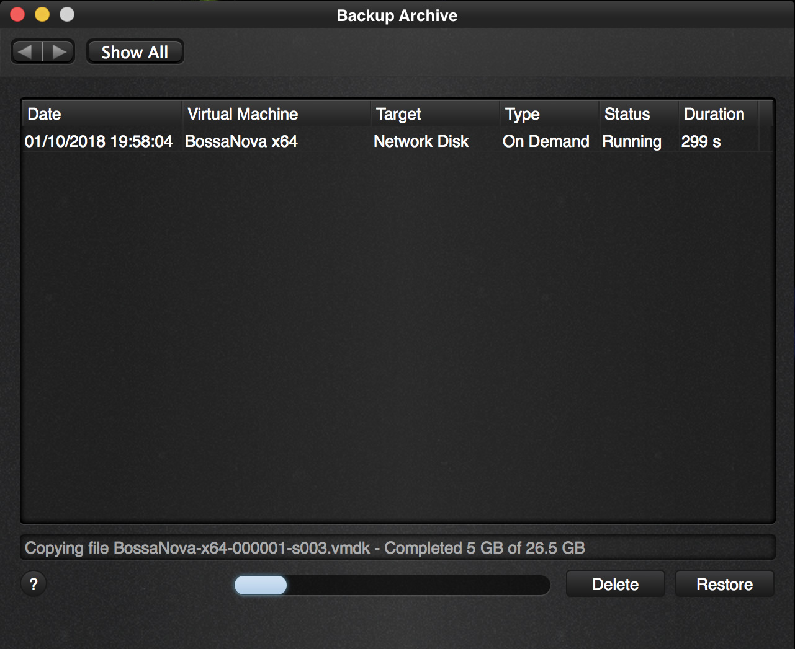
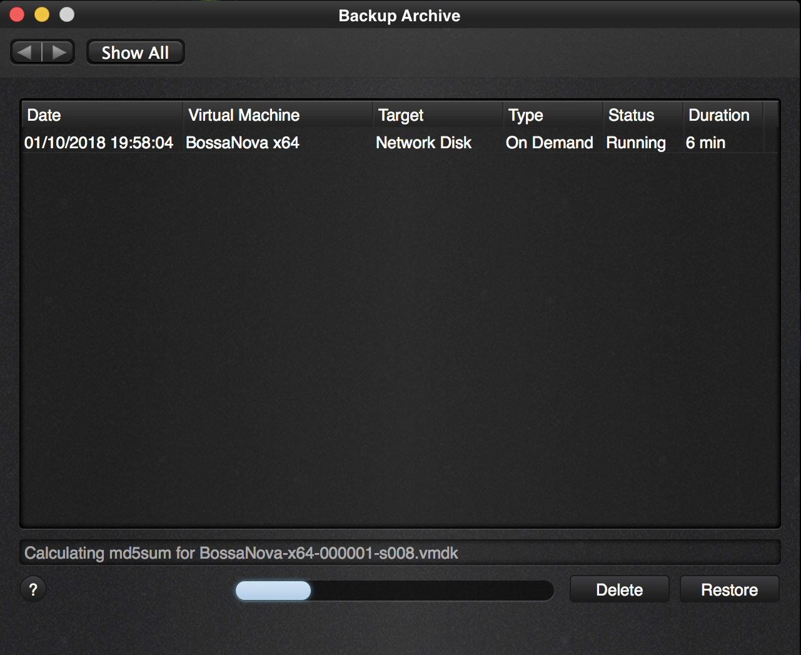
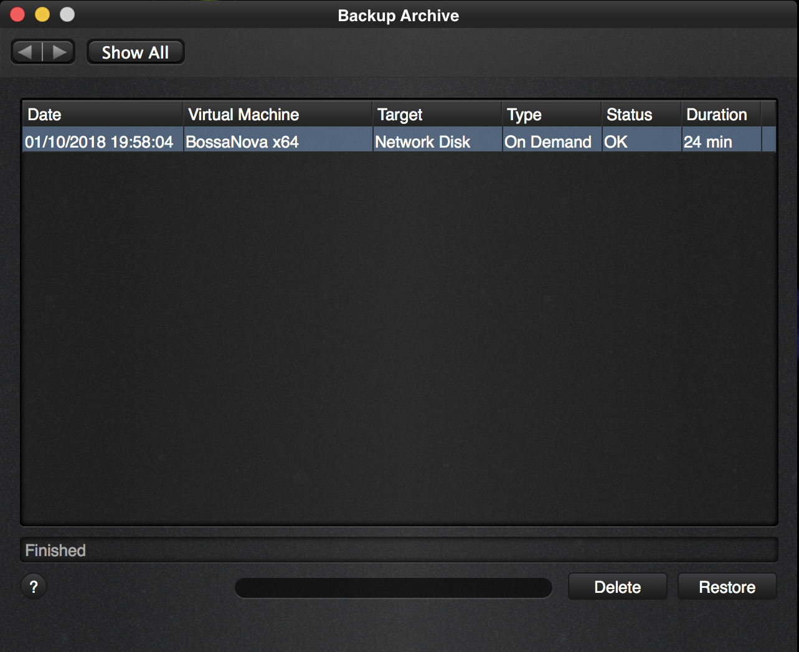

As we now have a virtual machine selected in the “Define a job” screen, we can run backups on demand.

  

Click “Backup Now” and you are presented with a question to confirm that you want to start a new backup.

 

Yes, we are sure that we want to run the backup now. Press enter as the “Yes” is pre-selected. This will notify our worker process that we want to run a backup immediately. If there is no other backup running, it will do so immediately, otherwise it will first finish the job it was working on.

The “Backup Archive” screen will show up after clicking Yes so that you can immediately follow up on the status.

  

As you can see it is executing our on demand job immediately as this is our first job and it is copying all the files. It does not matter if your virtual machine is running, has snapshots,  is suspended, shut down or paused. The backup will run regardless and take the situation into account without disturbing your VM.

  

Of each file that it copies it also makes an md5sum calculation. This is a digital signature of that file and is used later on to proof that the copy is correct. When you restore the VM, this md5sum signature is used to verify the integrity of the backup.

  

After a little while the backup is complete.

We have our first backup and can continue to look at our other options, like creating a schedule to run a backup.

