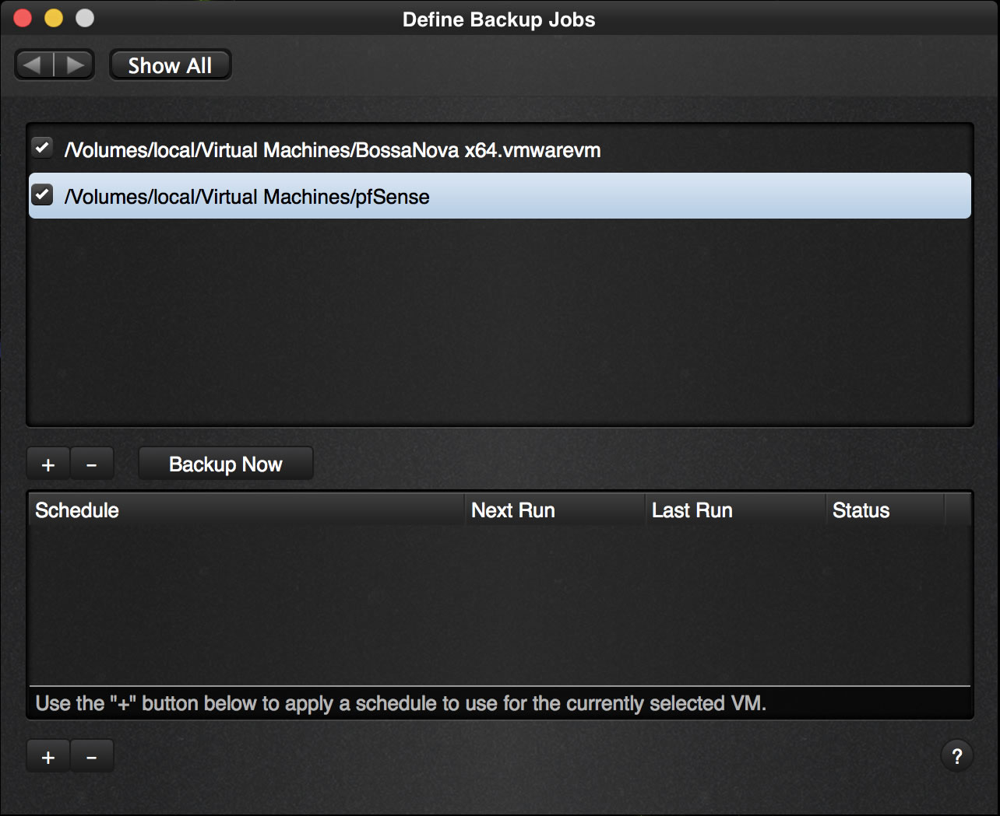
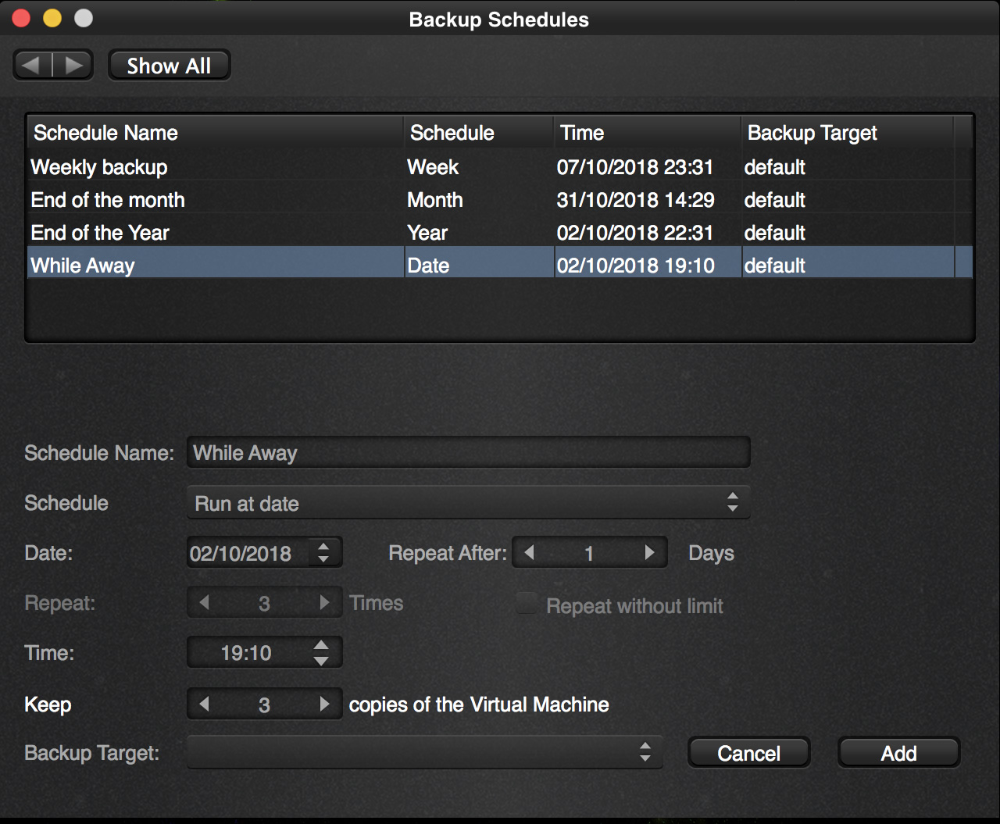
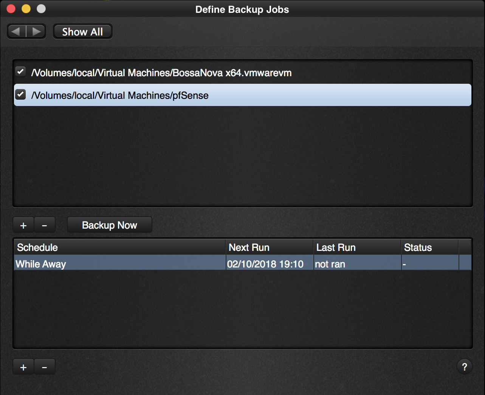

In order to schedule a job, go back to the options page.

 

From here, click on the “Backup Jobs” icon.

 

As you see we have added another Virtual Machine called “pfSense” to the list above and we selected it to schedule a job for the pfSense VM.

Click on the “+” button near the bottom.

 

Here you see the schedule “While Away” that we created earlier and we can select it as the one we want to run and setup. Click “Add” after selecting it and our schedule has been set.

 

The schedule is added and will run.

You can also see it at the home screen like this:

 

We can simply walk away or even close the application and the backup will still run.

So we close the application.

Afterwards we can check to see that the backup ran by [inspecting the Backup Archive](https://www.vimalin.com/documentation/schedule-a-job/inspecting-the-backup-archive-after-our-first-schedule/)

 
