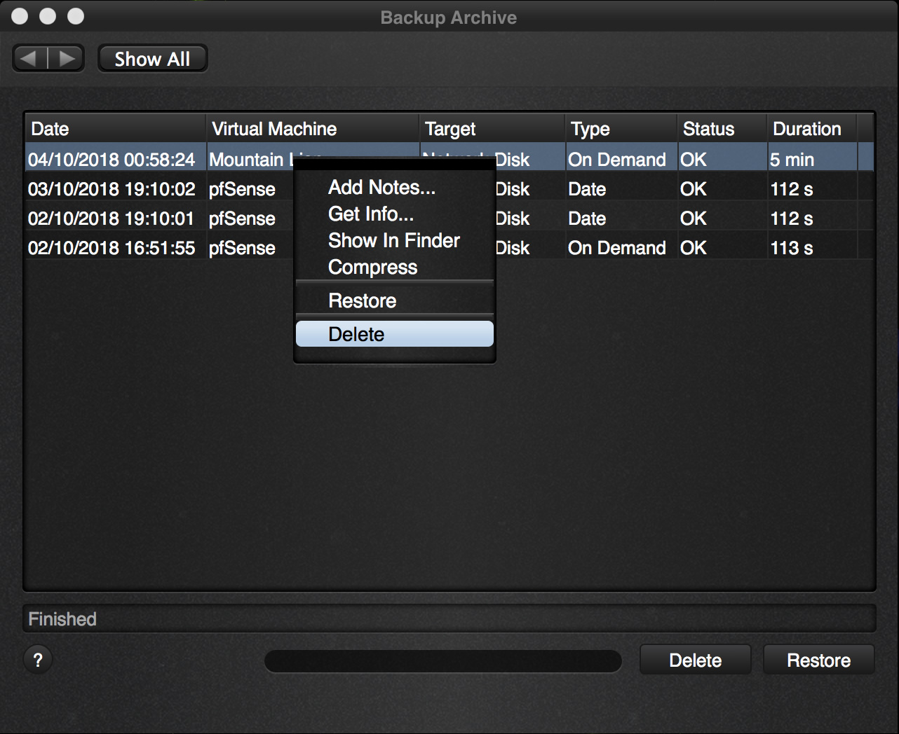
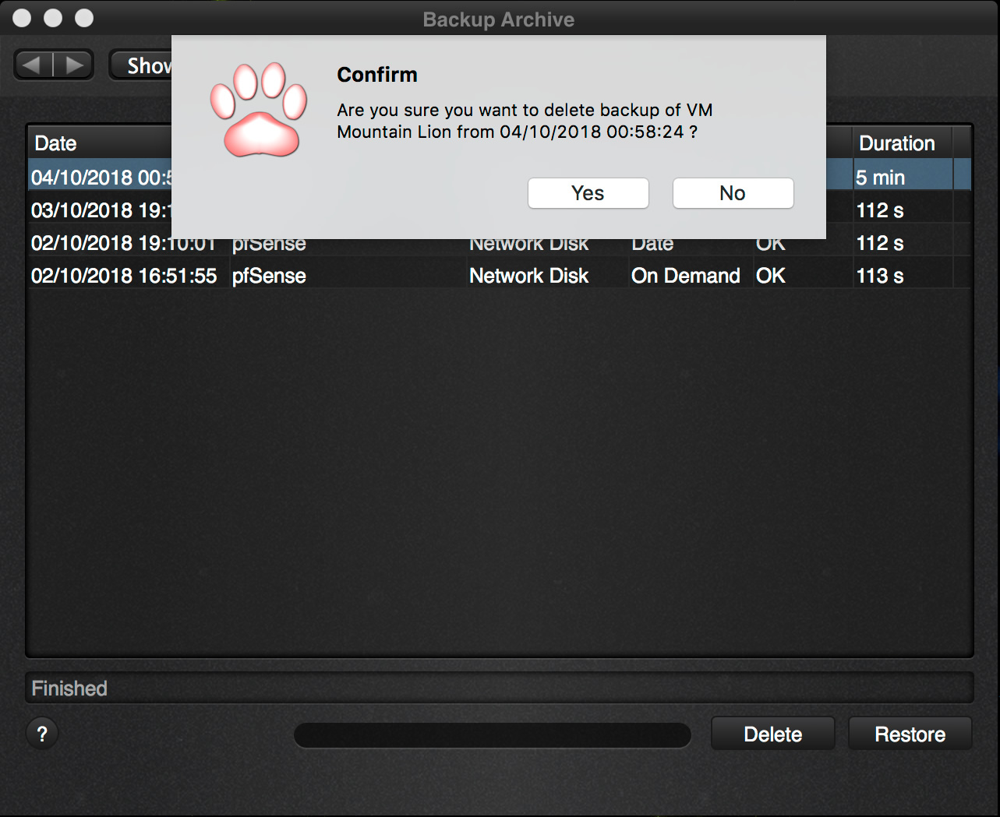
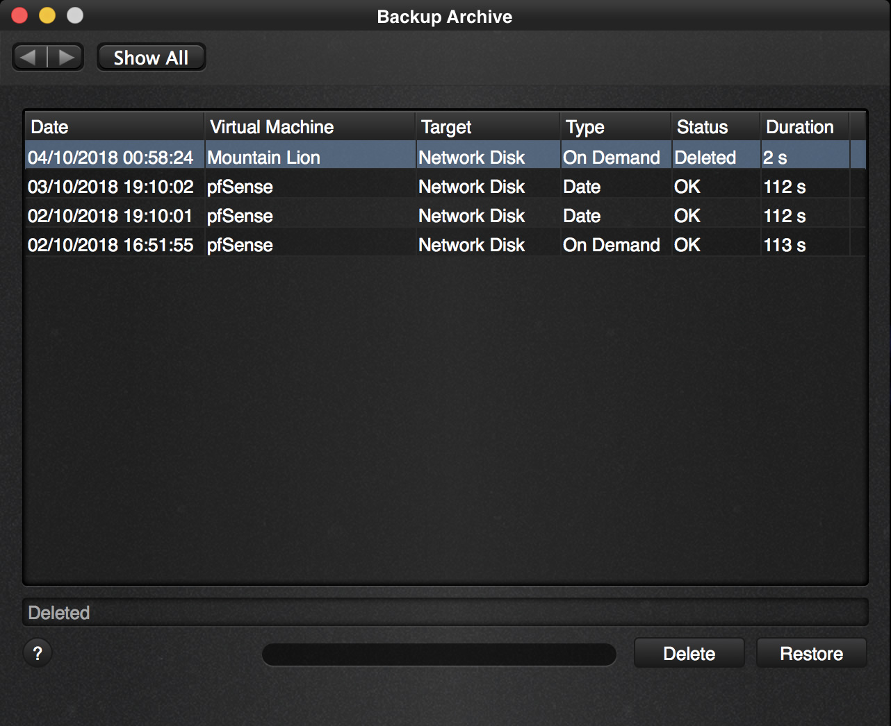

The Backup Archive screen shows a list of all the virtual machine backups that you have at that moment. If you want to remove a backup then this is also the screen where you would remove the backup. Removing the backup will:

1. remove it from the list of backups
2. reclaim the disk space on your backup disk so that it can be used for something else.

Deleting a backup is irreversible, you can not undelete a backup once it has been removed.

Let’s walk you through the steps.

First open the Backup Archive screen:

| 
|:--:|
| *Backup Archive – Delete a VM via the context menu* |

Select the backup that you want to remove and click the Delete button or use the context menu like above.

You will get a confirmation to make sure that this is actually the backup you want to remove.

| 
|:--:|
| *Backup Archive – Delete VM confirmation* |

If you want to actually delete, click yes and in the following screen the virtual machine is removed.

| 
|:--:|
| *Backup Archive – VM has been deleted* |

Note that if you click away and re-open the screen that the entry with the deleted status is filtered out so that formerly removed backups do not clutter up your overview.

